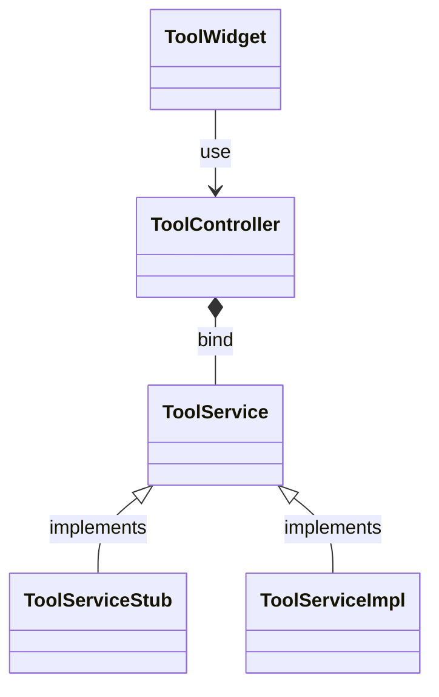

# Desktop Preferences

GUI tools written in Flutter to manage desktop preferences like WiFi, Bluetooth, Display etc.

## Getting Started

```shell
git clone --single-branch --branch master git@github.com:zxteamorg/desktop-preferences.git
cd desktop-preferences
flutter run
```

## Development

### System requirements

#### Linux

TBD

#### MacOS

1. See [Flutter installation notes](https://docs.flutter.dev/get-started/install/macos) for MacOS
1. Install [Xcode Developer Tools](https://apps.apple.com/us/app/xcode/id497799835)
1. Useful commands
	```shell
	sudo softwareupdate --install-rosetta --agree-to-license
	sudo xcode-select -s /Applications/Xcode.app/Contents/Developer
	sudo xcodebuild -license
	```

#### Windows

TBD

### Tool Class Diagram

